# 
Mi web personal de reseñas liteararias

El proyecto ha sido realizada usando HTML, SASS y JavaScript, React y Redux. 
Para las animaciones he utilizado framer motion y para los estilos y mdb-react y bootstrap-react, con lo que además es totalmente resposive. La web también consta de un back-end realizado en PHP/Laravel que es parte de este mismo proyecto (añado el enlace al final).

---

>Esta proyecto lo he diseñado con la finalidad de ser una web personal de reseñas litearias aunque está preparada para que nuevos usuarios se registren y publiquen sus reseñas o añadan nuevos libros.
---

# 💻 Tech Stack:

          

---
## Vista principal
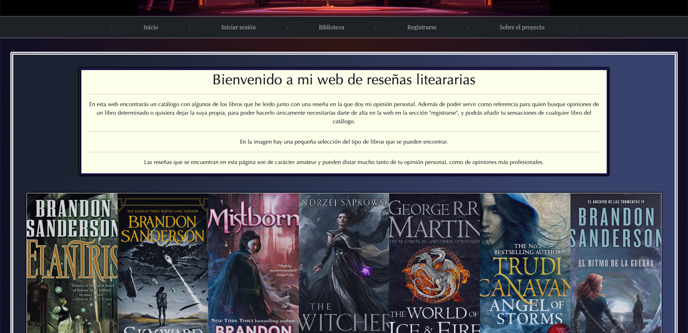
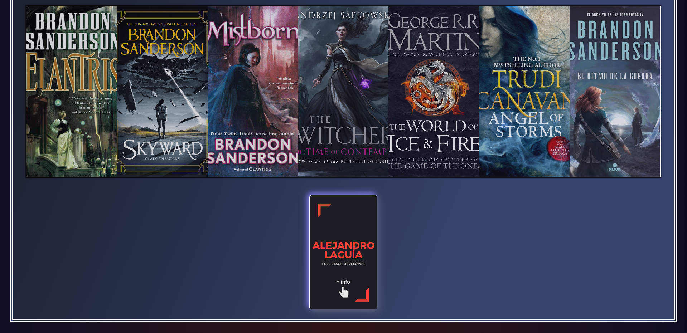
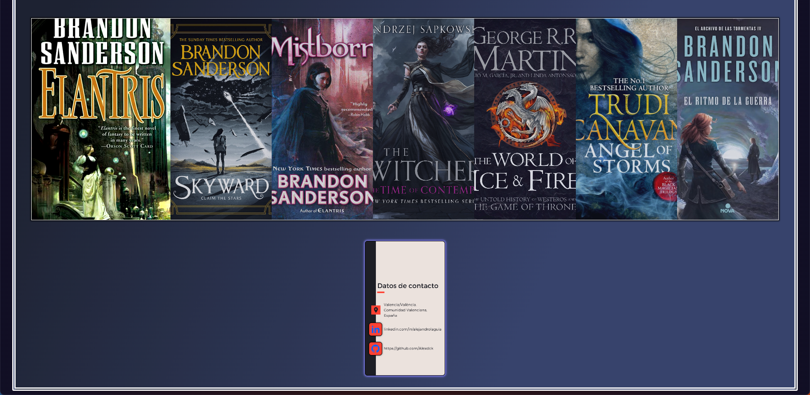

>Vista de inicio donde se da información del proyecto, una galería con un ejemplo de libros que puedes encontrar y una tarjeta de identificación.

---

### Inicio de sesión
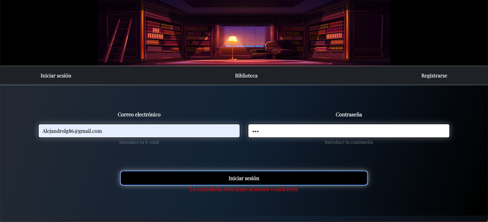
---

### Nuevo usuario
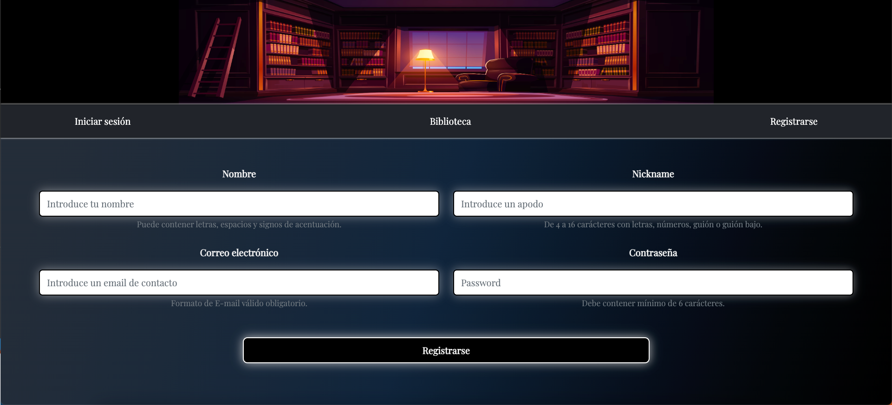

>Todos los formularios ya sea para crear un registro nuevo, editarlo o eliminarlo, constan de un sistema de validaciones.

---

### Vista sin autentificar
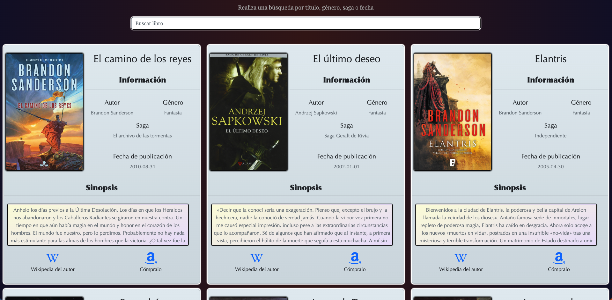

>Vista de los libros con la barra de búsqueda cuando no ha iniciado sesión un usuario.

---
### Vista autentificado
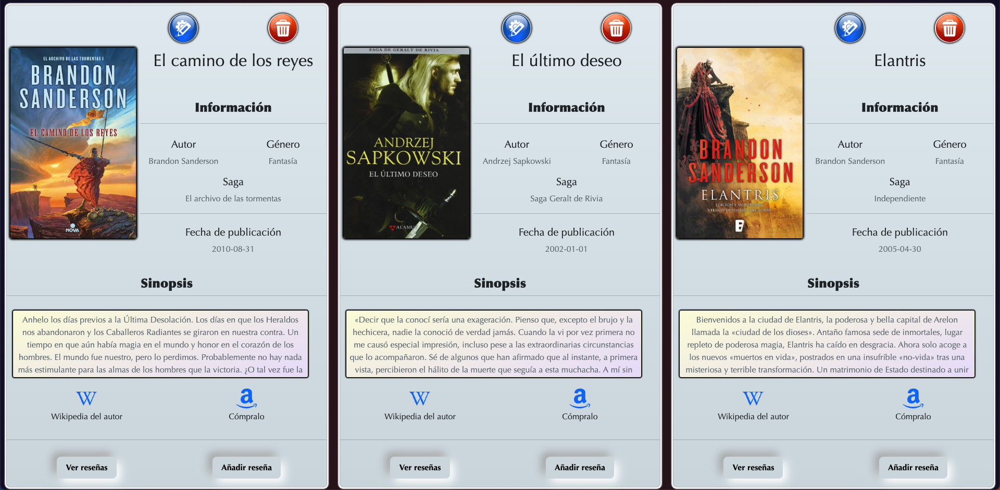

>Vista de los libros con la barra de búsqueda cuando no ha iniciado sesión un usuario.

---

### Editar o eliminar un libro

    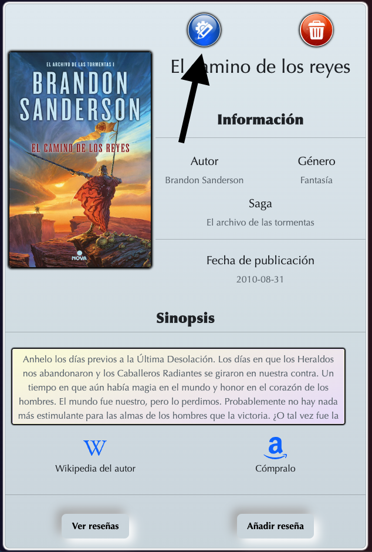
    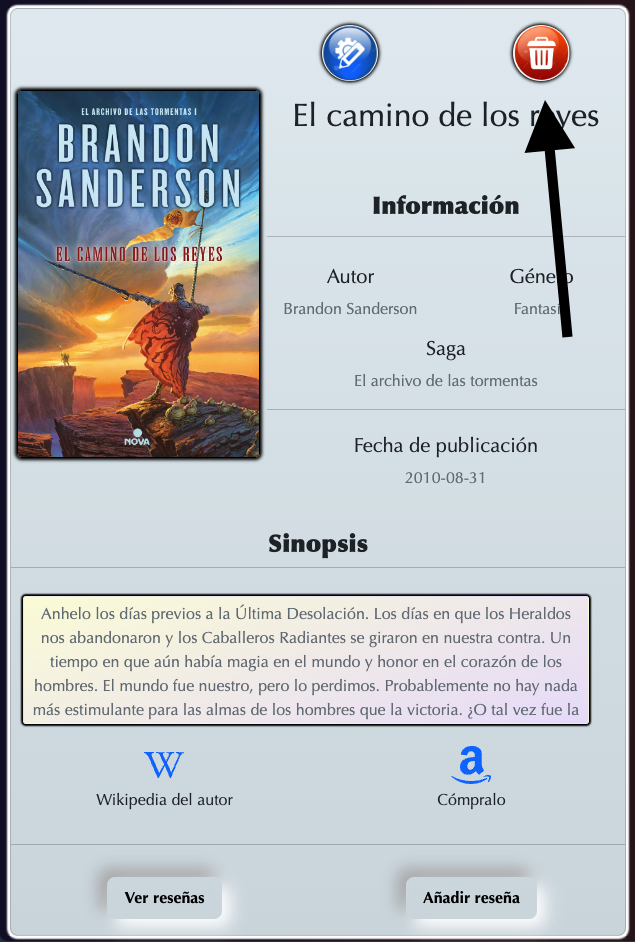

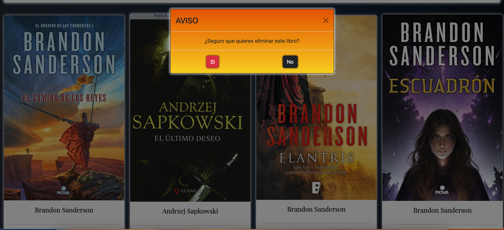

>Botones para eliminar o modificar un libro existente, solo visible y accesible para el administrador o el SuperAdmin con una ventana de seguridad para confirmar que se quiere eliminar el libro.

---

### Añadir un nuevo libro
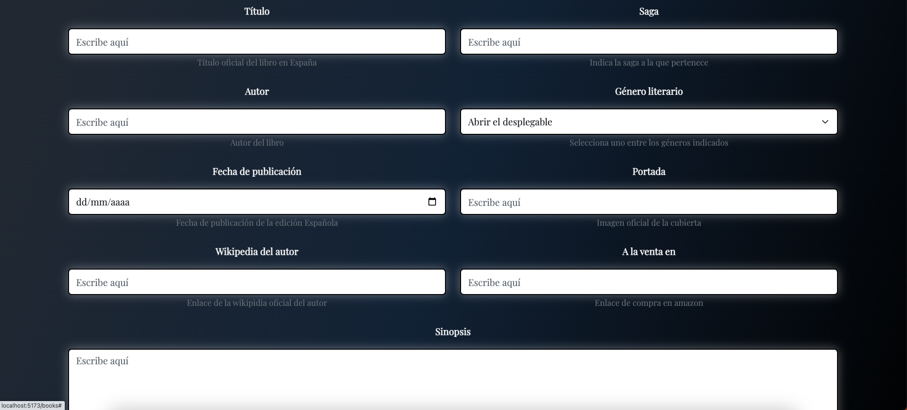

>Cualquier usuario registrado puede añadir libros nuevos en la biblioteca, quizás en un futuro esta opción cambie y solo pueda añadir libros el administrador o el SuperAdmin.

---

### Formulario de edición de libros
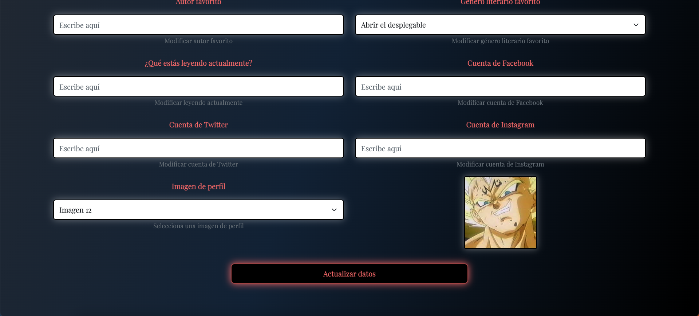

>Formulario con sus validaciones correspondientes para editar un libro existente, solo accesible para un administrador o el SuperAdmin.

---

### Vista de reseñas
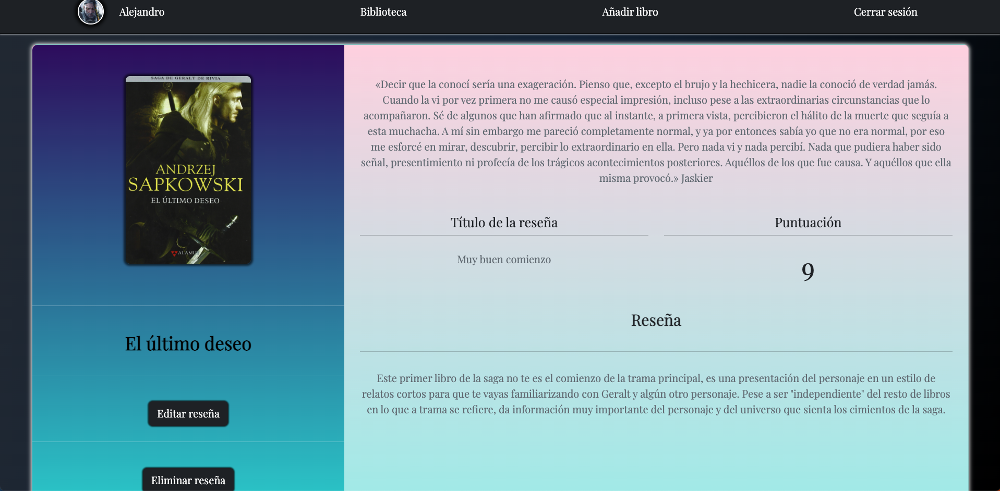

>Vista de las reseñas del libro seleccionado con opción de modificarlas o eliminarlas.

---

### Añadir una nueva reseña
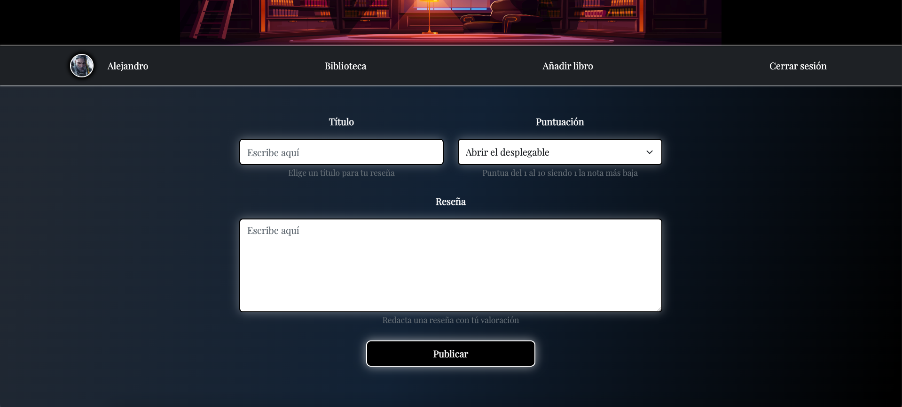

>Cualquier usuario registrado puede añadir reseñas, pero únicamente el usuario que haya creado la reseña podrá editarla o eliminarla.

---

### Vista del perfil de usuario
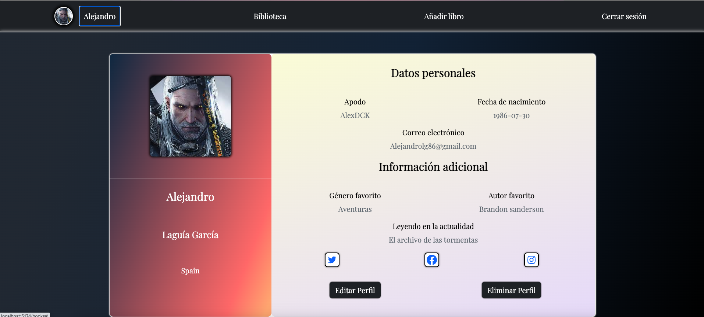
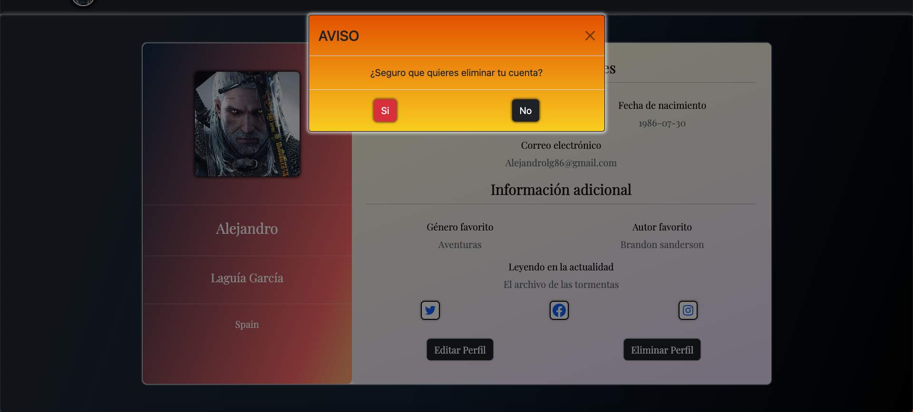

>Perfil del usuario, con opción de modificarlo o eliminarlo y ventana de seguridad para confirmar.

---

### Modificar datos del perfil

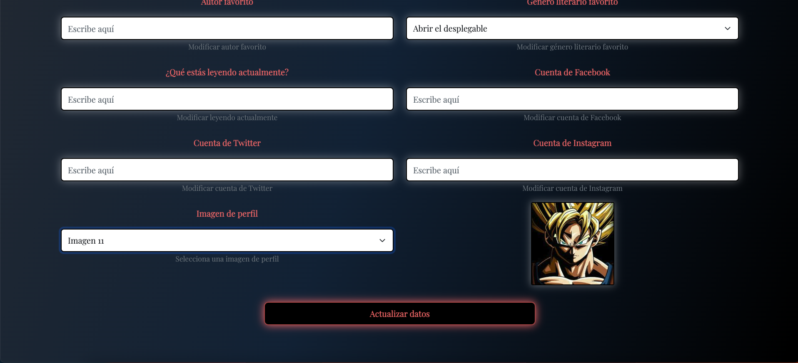

>Vista para modificar los datos de un usuario existente con opción de modificar la imagen por defecto del perfil a elegir entre más de 15 avatares precargados.

---
### Sobre el proyecto

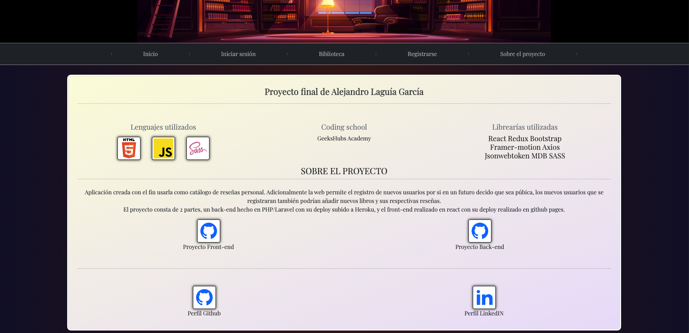

>Vista con las tecnologías que he utilizado, información del proyecto y enlaces a mi GitHub y Linkedin.

 

    

## 🌐 Socials:
 

### Repositorio del back-end asociado a este proyecto

https://github.com/Alexdck/Books_reviews_proyect

